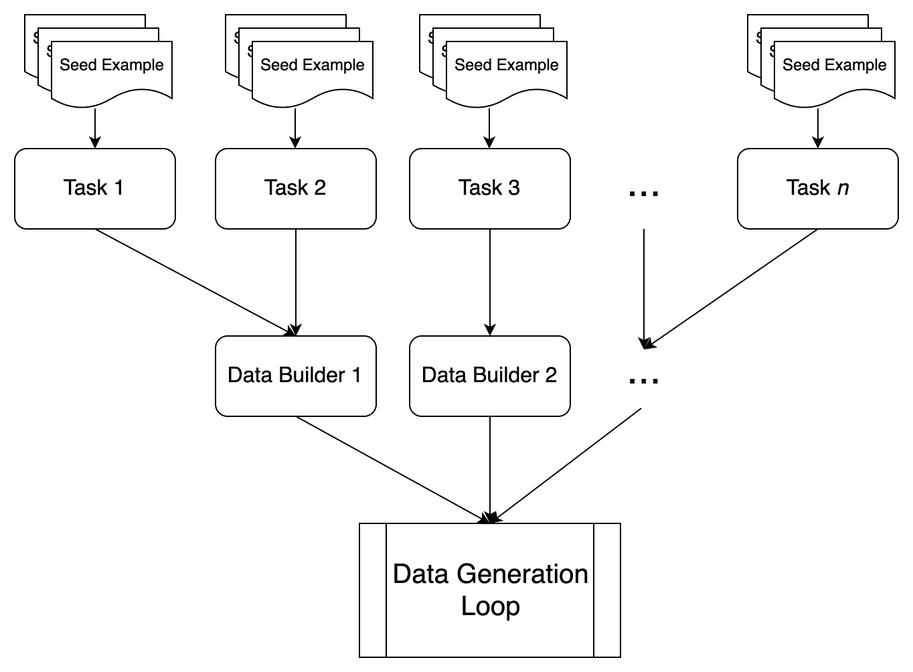
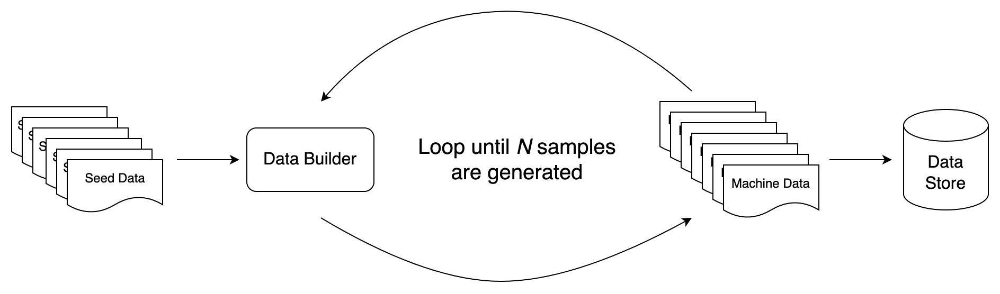

# Synthetic Data Generation (SDG) Design

## Abstract

Framework which enables different algorithms and models to be used to generate synthetic data. Have a defined interface on how algorithms and models can "Plug and Play".

## Motivation

Synthetic data generation (SDG) involves the use of computational methods and simulations to create data. This means that seed data is used to create artificial data that have some of the statistical characteristics of the seed data. This is a game changer when fine tuning models using user data contributions as it acts as a "petri dish" to magnify the data for tuning. As SDG can be resource intensive depending on the algorithm and model used, it would be really useful to be able to choose the algorithm and model as per your preference and resource capability.

## Rationale

If a user wishes to generate synthetic data on commodity hardware like a Mac M-series laptop, a modified version of [self-instruct](https://arxiv.org/abs/2212.10560) and a quantized model would be usable and performant. However, the fidelity of the data generation might be low. If the user has access to a Kubernetes cluster with 100 GPUs then using the [LAB](https://arxiv.org/abs/2403.01081) algoritm with a full model is a better option. The ability to be able to choose the algorithms and models on the fly using the framework is the key.

## Specification

### Architecture

The key architectural components are:

- Task: A task that will be executed by a data builder. It contains global definitions, termination criteria, and seed data
- Seed Data: The raw input data to the SDG algorithm
- Data Builder: The algorithm that generates the new synthetic data. Each builder expects the seed data to be in a standard format
- Blocks: The main unit of heavy-duty processing in fms-dgt. We provide a number of these to help speed up computation at known bottlenecks
  - Generator: Expensive computation that produces some output, most often a Large Language Model (LLM) which is used to generate synthetic data. Used by data builder
  - Validator: Validates the generated synthetic data. Used by data builder

The overall architecture is fairly straightforward. At the top level, there are _tasks_ and _databuilders_. Tasks specify independent data generation objectives. These will have their own seed data, their own termination criteria, their own global variable definitions, etc. Data builders specify the process by which data for a set of tasks should be generated. A data builder will have its own specification for what it expects as inputs. Roughly speaking, there is a many-to-one correspondence between tasks and data builders (though, in theory, tasks could be solved by different data builders as long as their data abided by the constraints of the data builder). Below we have a figure showing how both of these components pass into the main data generation loop



The data generation loop will continue to run until a set number of examples (specified with the `num_outputs_to_generate` argument to `generate_data`) is generated. It runs in an iterative loop where on each iteration, for a particular task, a data builder is passed (1) the seed data of the task and (2) _all_ of the data that has been generated for that task. After each iteration of the loop, it stores the data to the desired location (`output_dir` argument). Below we provide a diagram of this process



### Tasks

Data files are used to instantiate data generation tasks. An example of one can be found [here](../data/writing/freeform/debate/qna.yaml) (see below for the relevant snippet).

```yaml
created_by: IBM Research
data_builder: simple
seed_examples:
  - answer: Economist:\n"Implementing a universal basic income ..."
    question:
      Debate the merits and drawbacks of implementing a universal basic income
      between an economist, a sociologist, and a policy maker.
task_description: "Example of a task"
```

Our goal was to be as non-prescriptive as possible, allowing people to load their own data with their own fields without having to modify it to fit into the framework. As such, in the YAML, the only components that must **always** be specified are the `created_by`, `data_builder`, `seed_examples`, and `task_description` fields. Beyond those, there are no constraints to a data file, i.e., the designer of a task can include whatever they want here.

Internally, the data of a YAML file will populate [Task / Data objects](../fms_dgt/databuilders/generation/simple/task.py) (see below for relevant snippet)

```python
@dataclass
class ExampleSdgData(SdgData):
    """This class is intended to hold the seed / machine generated instruction data"""

    task_description: str
    instruction: str
    input: str
    output: str
    document: str

class ExampleSdgTask(SdgTask):
    """This class is intended to hold general task information"""

    DATA_TYPE = ExampleSdgData

    def __init__(
        self,
        *args: Any,
        **kwargs: Any,
    ):
        super().__init__(*args, **kwargs)

    def instantiate_example(self, **kwargs: Any):
        return self.DATA_TYPE(
            task_name=self.name,
            task_description=self.task_description,
            instruction=kwargs.get("question"),
            input=kwargs.get("context", ""),
            output=kwargs.get("answer"),
            document=kwargs.get("document", None),
        )
```

You can see from the above that the task object allows you to define your own example instantiation code. This can be used to add in global data (e.g., anything outside of the `seed_examples` field), to each data instance without having to store it redundantly in the YAML data file (i.e., copies of the same field for every entry of `seed_examples`).

As stated before, each iteration of generation will have the data builders taking in dataclass instances (both the seed examples and the examples generated thus far).

### Data Builders

Data builders (see [here](../fms_dgt/databuilders/generation/simple/generate.py) for an example) contain the means by which our framework generates data. They consist of some number of _blocks_, which can be _generators_ and / or _validators_. Generators are, roughly speaking, things that take in inputs and generate some output (e.g., most often an LLM taking in a prompt and then returning a string). Correspondingly, validators are things that inspect an object and return True or False to signify whether that object is valid (e.g., validating the output of an LLM for well-formedness constraints in the case of code generation).

Each data builder is defined with a \_\_call\_\_ function. Importantly, the call function takes as input a list of the dataclass instances described above. This leads to an inherent composability of data builders, where the outputs of one data builder can be fed as the inputs to another (ideally leading to more code reuse across the repository).

```python
def __call__(
    self,
    request_idx: int,
    instruction_data: List[ExampleSdgData],
) -> Tuple[List[ExampleSdgData], int]:

    ... code goes here ...

    return outputs, discarded
```

As with task definitions, we aimed to be very non-prescriptive in how the \_\_call\_\_ functions are defined. That being said, we do require any computationally expensive calls that leverage batch processes (e.g., LLM calls) to go through Generators / Validators (with generators for LLMs already being provided [here](../fms_dgt/blocks/generators/)).

An important aspect to keep in mind when defining a new data builder is the notion of _task parallelism_. That is, to make things more efficient, all tasks that can be executed by the same data builder will be run simultaneously. Thus, the inputs to the \_\_call\_\_ function will be a mixed list of instruction data (i.e., elements of the list can come from one of _N_ tasks). When doing things like combining instructions together (e.g., to serve as an ICL example to produce a new output), one has to make sure to keep track the provenance of the data.

Data builders are very configurable. An example of a configuration can be found [here](../fms_dgt/databuilders/generation/simple/simple.yaml) (see below for the relevant snippet).

```yaml
name: simple
blocks:
  - name: llm1
    type: genai
    arg_fields:
      - prompt
    kwarg_fields:
      - stop_sequences
    result_field: output
    temperature: 0.0
    max_new_tokens: 512
    min_new_tokens: 1
    model_id_or_path: mistralai/mixtral-8x7b-instruct-v01
  - name: val1
    type: rouge_scorer
    arg_fields:
      - new_toks
      - all_toks
    result_field: output
    filter: true
    threshold: 1.0
metadata:
  version: 1.0
```

In this, the `generators` and `validators` fields show the default settings for the generators and validators, respectively. This allows for trivial substitution of parameters like model types, LLM backends (e.g., `genai`, `vllm`, `openai`) without having to change the underlying code.

### Blocks: Generators and Validators

As mentioned above, in the data builder `__call__` function, you will make use of blocks, which can be "generators" and / or "validators". These are the components in this framework that do the heavy lifting. We have provided a number of LLM-based generators for [IBM GenAI](https://ibm.github.io/ibm-generative-ai/v3.0.0/index.html), [OpenAI](https://github.com/openai/openai-python) and [vLLM](https://github.com/vllm-project/vllm). To use a specific generator, you need to specify it in both the YAML and in the `generate.py` file as a attribute of the task's class. From a design standpoint, we aim to keep all multiprocessing and parallelism contained to the generators and the validators, i.e., **not** in the `__call__` function. By defining these ahead of time and restricting heavy operations to these objects, we can allow for better performance optimizations in terms of speed and resource allocation.

To define a new generator or validator, first take a look at the base classes that the concrete implementation will inherit from. These are found in `./fms_dgt/base/blocks/<generators/validators>/<generator/validator>.py`. All blocks must define a `generate` function which contains their main logic.

Blocks are designed to be composable and specifiable through both config and code. A block will take as its main inputs an iterable of dictionaries, a huggingface dataset, or a pandas dataframe (see `./fms_dgt/base/block.py`). In addition, in either the \_\_init\_\_ of the block or in the call to the block, one can specify `arg_fields`, `kwarg_fields`, and `result_field`. When processing its inputs, the block will iterate over each row / element of the input and extract the args / kwargs. The core computation of the block (e.g., an LLM call in `./fms_dgt/blocks/generators/llm.py`) is then run on those extracted args / kwargs and the result for a particular element is written to the `result_field`.

For example, a generator might be called with:

```python
inp = {
  "prompt": "Respond 'yes' or 'no'",
  "stop_sequences": ["yes", "no"],
  "temperature": 1.0
}
inp_lst = [inp]
llm_outputs = llm_class.generate(inp, arg_fields=["prompt"], kwarg_fields=["stop_sequences", "temperature"], result_field="result")
```

and the output may be extracted with

```python
for llm_output in llm_outputs:
  print("Original prompt: " + llm_output["prompt"])
  print(f"Result: {llm_output['result']}")
```

Importantly, the `result_field` is _written_ onto the object that is passed in. Hence, if you want drag along additional elements in the dictionary, you just add those as fields to the input. Typically, in the process of SDG you are building up some object to return. This could be passed to through block as

```python
inp = {
  "prompt": "Respond 'yes' or 'no'",
  "stop_sequences": ["yes", "no"],
  "temperature": 1.0,
  "data": SdgObjectBeingGenerated
}
inp_lst = [inp]
```

### Interfaces

The interfaces are as follows:

- `generate_data()`: Generate synthentic data
  - `data_paths` (str): One or more paths to data directory (or data files), this is where all task data will be loaded from
  - `num_outputs_to_generate` (int): Number of outputs to generate
  - `num_prompt_instructions` (int): Number of prompt instructions to generate
  - `max_gen_requests` (int): How many iterations of generation should be attempted
  - `output_dir` (str): Path to output generated data
  - `lm_cache` (str): Use db cache for LM generation at location (or create one at that location if a cache does not exist)
  - `include_data_path` (str): Path to specify data overrides
  - `include_builder_path` (str): Path to specify data builder config overrides
  - `prompt_file_path` (str): Optional path to a prompt file (optional, used for some databuilders)
  - `console_output` (bool, default=True): Print certain logging messages to console
  - `restart_generation` (bool, default=False): Erase existing synthetic data for specified task and restart generation from scratch

To call this from the command line use the \_\_main\_\_.py file, e.g.,

```shell
python -m fms_dgt.__main__ --data-paths ./data/generation/logical_reasoning/causal/qna.yaml
```

To run all files in a directory, just specify the top-level directory

```shell
python -m fms_dgt.__main__ --data-paths ./data/generation/logical_reasoning/
```

To run specific list of files and/or directories, you can pass multiple data paths

```shell
python -m fms_dgt.__main__ --data-paths ./data/generation/logical_reasoning/causal ./data/writing/freeform
```

### Implementation

The framework is to be implemeted as a Python library. Here is an example of calling SDG using the framework:

```python
# Local
from fms_dgt.generate_data import generate_data


generate_data(
    num_outputs_to_generate=2,
    num_prompt_instructions=2,
    data_paths=["data"],
    max_gen_requests=2,
    output_dir="output",
    lm_cache=None,
    include_data_path=None,
    include_builder_path=None,
    prompt_file_path="prompt.txt",
    restart_generation=True,
)
```

## Extending Scalable SDG Capability

### Defining a New Data Builder

Data builder defines the algorithm, generation and validation for a SDG process. The builder is defined by 4 main components:

1. A configuration YAML file in the `./fms_dgt/databuilders` directory. For example, `./fms_dgt/databuilders/simple/simple.yaml`
2. A Python file called `generate.py` which defines the data builder class. For example, `./fms_dgt/databuilders/simple/generate.py`
3. A Python function `__call**` within a data builder class which is the entry point for calling the data builder. For example, `SimpleInstructDataBuilder.__call**` in `./fms_dgt/databuilders/simple/generate.py`
4. A Python file called `task.py` which defines the expected data schema. For example, `./fms_dgt/databuilders/simple/task.py`

**Note:** When a data builder is loaded, the `generate.py` file is imported by the session manager. If you have any dependencies, you'll want to make sure that they are specified in that file.

To define a new data builder, make a directory for your data builder in the data builders subdirectory. You can copy over the YAML and `generate.py` file from the `./templates/` directory to get started. Once you have finished defining the data builder, you can then change the `data_builder` field of any YAML data file in the data directory to point to the data builder you've just defined. Then you can run the code as shown in the [README](../README.md#testing-out-the-framework).
